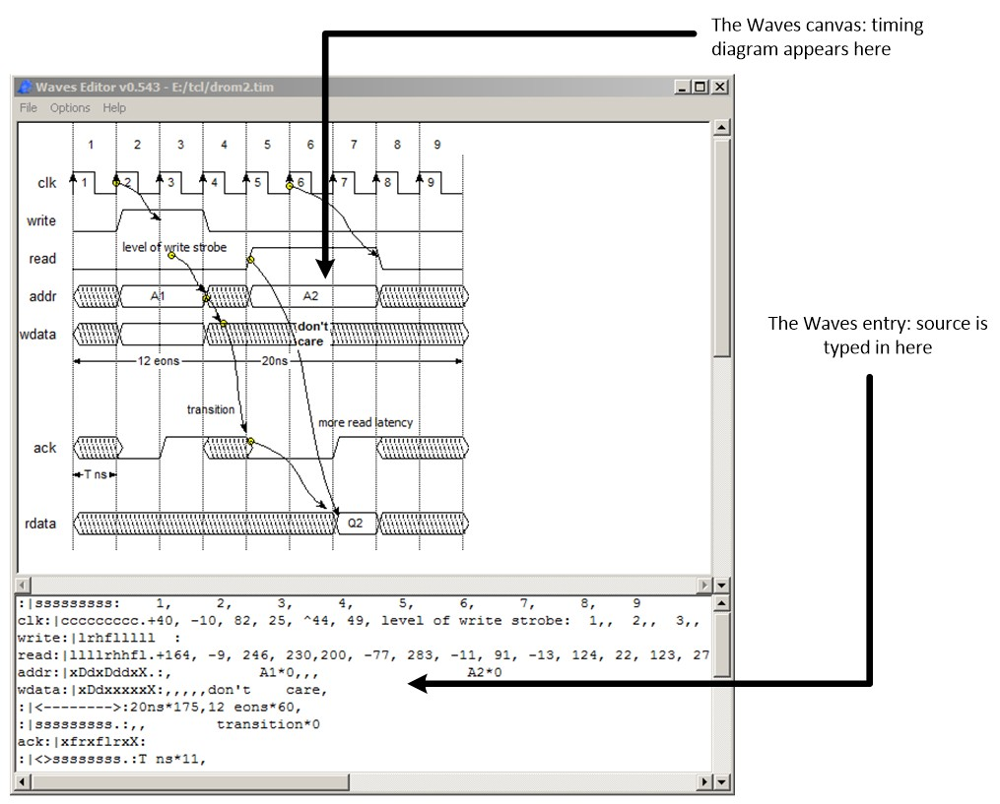

# waves
Waves is a simple timing diagram editor written in Tcl/Tk that saves waveform information as a text file.
A Windows binary (made with starkit) is availble, and the source can be run using
wish if Tcl/Tk is installed on most OSs.

See [here](https://github.com/hacksterous/waves/blob/master/docs/Waves%20Timing%20Diagram%20Editor.pdf) for a detailed document.
